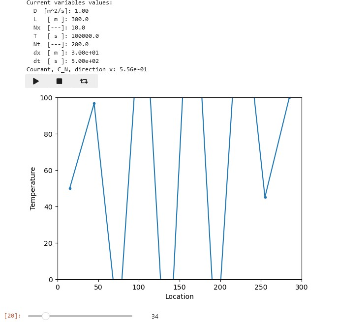
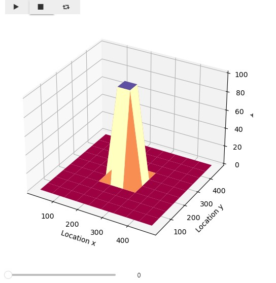

# Project 5 Report: Finite Volume Method

*[CEGM1000 MUDE](http://mude.citg.tudelft.nl/).*

**Group: ROUT1**

## Relevance

The diffusion equation in both 1D and 2D can for example be used to model the heat conduction trough a solid material. The 1D model can be used for heat conduction through a one-dimensional object like a rod, whereas the 2D model can be used for a two-dimensional object like a plate.

The diffusion equation given in the notebook assignment: 
$$
\frac{\partial \phi(\mathbf{x},t)}{\partial t} = D\nabla^2 \phi(\mathbf{x},t)
$$
differs from the one given in the MUDE textbook:
$$
\frac{\partial \phi}{\partial t}
+  \mathbf{u} \cdot \nabla \phi
= C \nabla^2 \phi
$$
As can be seen one term is left out in the equation in the notebook assignment, specifically the "u" term. This term is used for convection in the advection-diffusion equation. Effectively this means the models in this report can be used for heat conduction in solid materials, but the models can not be used for situations with convection (for example in fluids).

## Finite Volume Discretization, 1D
The image below shows the discretized form of the diffusion equation in 1D for the Finite Volume Method. This derivation uses the central difference to discretize the equation in space and the forward Euler in time. 

***Figure 1: Discretization of the FVM in 1D***

***Figure 2: Unstability in the 1D model***

## Finite Volume Discretization, 2D

***Figure 3: Discretization of the FVM in 2D***

***Figure 4: Stable situation in the 2D model***

## Stability analysis

#### 1D stability analysis
From the 1D diffusion model, it was found that varying the discretization values $\Delta t$, $\Delta x$, and $D$ in the 1D model results in a stability criteria of a Crouant number of $1/2$. Where the value of the Courant number being smaller than $1/2$ reaches a stable solution and a value larger than $1/2$ becomes clearly unstable after a certain amount of timesteps. A stable solution ultimately results in a linear interpolation between the two boundary conditions. On the other hand, an unstable solution goes towards very high and very low values, this can be seen from *Figure 2*. In addition, it was found that $\Delta t$ and $D$ increase the Courant number, whereas $\Delta x$ decreases it.

All the findings are in accordance with the following formula for the Courant number given in the notebook assignment:
$$\frac{D\Delta t}{(\Delta x)^2} \leq \frac{1}{2}$$

#### 2D stability analysis

This formula was given in the notebook assignment. The formula for the Courant number of the 2D diffusion model was not given. By experimenting with the 2D model, the correct formula for the could be found. Logically, the formula for this Courant number could be a sum of the Courant number in both directions (x and y):
Eq 1: $$C_N = \frac{D\Delta t}{(\Delta x)^2} + \frac{D\Delta t}{(\Delta y)^2} \leq \frac{1}{2}$$
Or it could be that both seperate conditions (in both x and y directions) need to be satisfied :
Eq 2: $$C_N = \frac{D\Delta t}{(\Delta x)^2} \leq \frac{1}{2}$$ and $$C_N = \frac{D\Delta t}{(\Delta y)^2} \leq \frac{1}{2}$$
Experimenting with the results of different values of $\Delta t$, $\Delta x$, $\Delta y$ and $D$ in the 2D diffusion model confirms that Eq 1 is the correct one. The parameter values for the instability are shown in Figure 5. The initial state of the system is shown in figure 6 and the unstable situation after a certain time steps is shown in figure 7. 

***Figure 5: 2D Parameters for instability.***

***Figure 6: 2D Initial state of the system.***

***Figure 7: 2D Unstable state of the system.***

For completeness we show the params for the stable situation in figure 8, and the stable situation after a certain number of time steps in figure 9. 

***Figure 8: 2D Parameters for stability.***

***Figure 9: 2D Stable state of the system.***

Clearly, when the sum of the Courant numbers is: $C_Nx + C_Ny > \frac{1}{2}$ as is the case in figure 5, the solution to the diffusion equation is unstable. Whereas, when the $C_Nx + C_Ny \leq \frac{1}{2}$ as is the case in figure 8, the solution is stable. 

## General Comments on the Assignment
We accidently removed some text from our deepnote 15min before the deadline. Therefore, we used some time after the deadline to fix the last issues that were caused by our attempt to recover our mistake. Maybe there are still some issues in the markdonw file. Our apologies!

&copy; Copyright 2023 <a rel="MUDE Team" href="https://studiegids.tudelft.nl/a101_displayCourse.do?course_id=65595">MUDE Teaching Team</a>, TU Delft. This work is licensed under a <a rel="license" href="http://creativecommons.org/licenses/by-nc-sa/4.0/">CC BY-NC-SA 4.0 License</a>.

**End of file.**